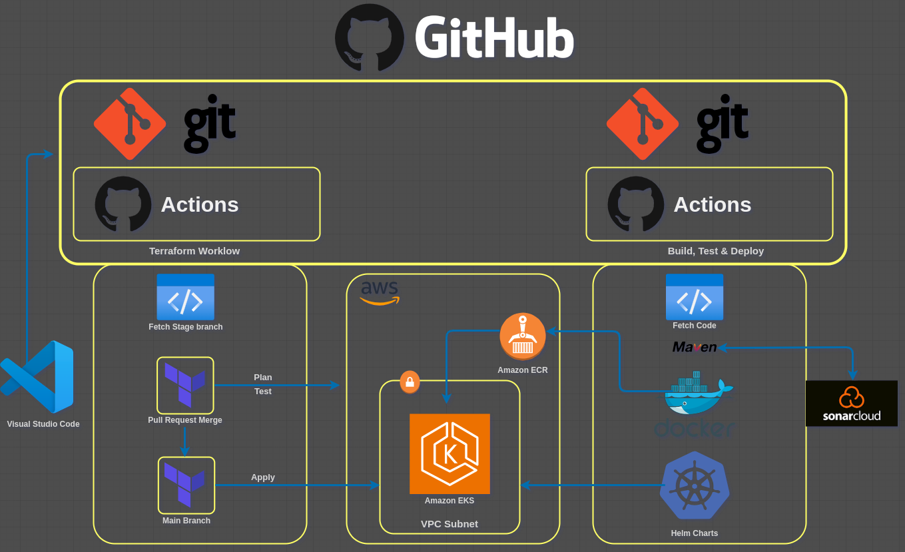

# GitOps

Everything with code, GitOps is a subset of DevOps. A best strategy of modern DevOps. Simply put, it is `Everything in code & Git for code`, all changes should be managed by Git.

### Automation Problems

1. Automation and also manual changes
2. Drift in Infrastructure
3. No history of changes
4. Microservices complexity
5. No versioning of infra level changes

Git is a version control system, now how about extending it to manage operation changes. That's where GitOps comes in.

### Ingredients

- Code
  - CICD automation code
  - Infra automation code
- Git
  - versioning all the changes
  - Single place automation code tracking
  - Restricting users access to only git
- Tools 
  - Tool to read changes in git
  - Apply the differences at the infra level, the pipeline level and dev code level

In summary, for example you have cloud infra, e.g. VPC, RDS, Cache, EKS to host an app on it. This is the business logic part of it.

The code's version control is managed by **Git**, i.e. the App code, CICD Pipeline code (Jenkins), and cloud automation code (Terraform/Cloud Formation). This in practice should be different repositories  that are separate from each other. All these repos will be Git repositories, these changes are automated to a certain extent and the missing parts are done manually, this end the end brings up the challenges mentioned before. In an nutshell GitOps tries to restrict manual changes through applying policies in place. For example, no console access for the user, just programmatically accessing the cloud.

### Solution

All users will commit their respective teams code i.e. dev team, devops team, and ops team in Git, then use so called **GitOps Tools** listed below, they'll detect the changes at infra level, pipeline, or code level and then apply these changes accordingly.

- Github Actions
- GitLab
- ArgoCD
- Tekton
- Jenkins X

### Architecture of the Project

We will have two separate repositories on GitHub, one for Terraform code and the other for the application code. Both will have separate workflows which will detect and track the changes and trigger appropriate responses to apply the changes accordingly. 

We will fork two Git repos, set the SSH authentication with the repos. Use Visual Studio Code to write the workflows. The VS Code repos will be integrated with GitHub, the first will be creating Terraform Workflow by using GitHub Actions to implement any changes. 

**Terraform Workflow/Pipeline/CICD**

- First, it will fetch source code that has two branches, namely; `stage` and `main`
- When changes are made to the `staging` branch, the workflow will detect it, the Terraform code will be tested, basically it run two commands, `terraform validate` and `terraform plan` commands to check and test the code against AWS cloud and return the list of changes that will be applied before the actual application. The workflow will then break complete
- When the `staging branch` is validated successfully, it'll be merged to the main branch, this brach is always locked to apply any changes. For any changes to be applied, a `pull request` should be made by the engineer who was working on the code changes, the changes are then checked by the owner of the main branch who can approve or disapprove the `pull request` that will merge the staging branch with the main branch
- When the main branch detects the changes, the workflow will apply the changes to AWS infrastructure resources, ie. VPC and EKS

**Application Code Workflow/Pipeline/CICD**

This will have application code, a Dockerfile and Kubernetes definitions files, this is to apply any changes in the application.

- We will have a workflow that'll fetch the code, build the code, test the code and deploy the code
- We will use Maven CheckStyle and Sonar Code Analysis CLI that will test the source code and validate it with Sonarcloud Quality Gates
- If everything checks out fine, it'll build docker images and upload them to Amazon ECR
- We will use Helm Charts, these are bundles of Kubernetes Definition file, it 'll also have a variable that mentions the `tag` and `image` names, basically, from where to fetch the image and what image to fetch
- This information will be parsed in the workflow automatically, the tag info will be passed to the Helm Charts, and the Helm Charts will executed on the EKS cluster, the Kubernetes cluster will detect the change of the image tag and it will fetch from ECR and run the application

### Prepare Github Repos

1. Fork the repo by going [here](https://github.com/hkhcoder/iac-vprofile/fork). Uncheck the **Copy the `main` branch only** and hit the Create fork

2. Fork the application repo by going [here](https://github.com/hkhcoder/vprofile-action/fork). Uncheck the **Copy the `main` branch only** and hit the Create fork

3. SSH Key Exchange from our computer with your GitHub account

    Create and SSH key named `git-actions`

       $ cd ~/.ssh
       $ ssh-keygen
       $ cat git-actions.pub 

4. Go to GitHub > click on the user icon > Settings > SSH and GPG keys > New SSH key > name it `git-actions-key`, paste the public key > hit Add SSH key

5. Export the SSH Key a variable

       $ export GIT_SSH_COMMAND="ssh -i ~/.ssh/git-actions"

6. Create folders where to clone the repos in GitHub

       $ mkdir ~/Documents/gitOps && cd ~/Documents/gitOps

7. Clone the SSH iac source code 

       $ git clone git@github.com:mbadwa/iac-vprofile.git

8. Clone the SSH app source code

       $ git clone git@github.com:mbadwa/vprofile-action.git

9. Inject the SSH key in `iac-vprofile` repository
    

       $ cd ~/Documents/gitOps/iac-vprofile
       $ git config core.sshCommand "ssh -i ~/.ssh/git-actions -F /dev/null"

10. Inject the SSH key in `vprofile-action` repository

        $ cd ../vprofile-action
        $ git config core.sshCommand "ssh -i ~/.ssh/git-actions -F /dev/null"

11. Set git username and email if not set

        $ git config --global user.name mbadwa
        $ git config --global user.email mcneil.chaweza@inglesnow.io

12. Copy the iac repo folder to `main-iac`

        $ cd ../
        $ cp -r iac-vprofile main-iac
        $ cd iac-vprofile
        
13. Checkout to the `stage` branch, that's where the changes will only be performed

        $ git branch -a
        $ git checkout stage
        $ git status
        $ git branch

### GitHub Secrets

1. Create secrets for `iac-vprofile` and `vprofile-action` repos
   
   Create user with access credentials in AWS
   - Go to IAM > Users > Create user > User name: `gitops` 
   - Hit Next > Add user to group > `admin` > Hit Next > Create user
   - Click on `gitops` user > Security Credentials > Access keys > Create access key > Use case > Select Command Line Interface (CLI)
   - Check the Confirmation box > Next > Create access key
   - Copy the `Access key` and paste in `iac-vprofile` and `vprofile-action` repos
   - Copy the `Access key` and paste in `iac-vprofile` and `vprofile-action` repos
   
   Safely copy the access keys and secrets into GitHub for each repo
   - In GitHub, go to `iac-vprofile` repo > Settings > Secrets and Variables > Actions > New repository secret
     - Name: `AWS_ACCESS_KEY_ID`
     - Secret: Paste the secret key ID in the container
     - Hit Add secret
   - Hit New repository secret
     - Name: `AWS_SECRET_ACCESS_KEY`
     - Secret: Paste the secret access key in the container
     - Hit Add secret
   - Repeat the above steps for the `vprofile-action` repo
   - In AWS hit the Done button > Hit Continue
2. Create an S3 bucket for Terraform files
   - Go to S3 > Create bucket > name-your-bucket > Create bucket
   - Copy bucket name, in GitHub, go to `iac-vprofile` repo > Settings > Secrets and Variables > Actions > New repository secret
     - Name: `BUCKET_TF_STATE`
     - Secret: Paste you-bucket-name in the container
     - Hit Add secret
  
    NOTE: This only applies to Terraform repo the `iac-vprofile`

3. Create an Elastic Container Registry (ECR) Repository

   - Go to ECR > Create repository > Repository name: `vproapp`
   - Hit Create
   - Copy URI
   - Go to `vprofile-action` repo > Hit New repository secret
     - Name: `REGISTRY`
     - Secret: Paste the URI without the `/vproapp`
     - Hit Add secret
   
  NOTE: The AWS Secret keys won't be downloaded to local machines for security reasons, to avoid any leaking of the keys to third parties. Bots can scan access keys and start bitcoin mining using your AWS account in the end raking up huge bills.

### Terraform Code Breakdown

We will use Terraform code for infrastructure deployment.

1. Open the `iac-vprofile` code in VS Code and switch to staging branch

        $ cd ~/Documents/gitOps/iac-vprofile
        $ code .
2. `variables.tf` [file](https://github.com/mbadwa/iac-vprofile/blob/main/terraform/variables.tf) breakdown
    - Variable `region` defines region `us-east-1`
    - Variable `clusterName` defines cluster name `gitOps-eks` 

3. `terraform.tf` [file](https://github.com/mbadwa/iac-vprofile/blob/main/terraform/terraform.tf) breakdown
    - Terraform module version defined at the bottom `v ~> 1.6.3`
    - Providers
      - `aws` provider
      - `random` for generating random text
      - `tls` certificate for Kubernetes 
      - `cloudinit` During boot, cloud-init identifies the cloud it is running on and 
        initializes the system accordingly. Cloud instances will automatically 
        be provisioned during first boot with networking, storage, SSH keys, packages 
        and various other system aspects already configured.
      - `Kubernetes` provider version 
    - Backend section defines `S3` bucket's details
    - Backend will create a Terraform state file in S3. This is crucial to avoid infrastructure code drift. 
      if this section isn't there, the each engineer making changes to the code will have their own separate `terraform-tf` state file.
      This can can lead to inconsistent infra changes. 
    
4. `vpc.tf` [file](https://github.com/mbadwa/iac-vprofile/blob/main/terraform/vpc.tf) breakdown 

    - Terraform VPC module
      -  `source` mentioned the name of the source module
      -  version of the VPC module
      -  `name` of the EKS cluster
      -  `cidr` network allocation
      -  `azs` is the availability zones in the region, the list will be pulled from 
         the `data`  section of the `main.tf` [file](https://github.com/mbadwa/iac-vprofile/blob/main/terraform/main.tf),
         this lists all the azs and the first three will be picked.
      - `private_subnets` defines the private VPC's subnets for the three azs
      - `public_subnets` defines the public VPC's subnets for the three azs
      - `enable_nat_gateway` enables nat services
      - `single_nat_gateway` this creates a gateway for the public subnets. 
  
        NOTE: For high availability in production, that can be skipped in order to have a separate NAT gateway for each az
      - `enable_dns_hostnames` self explained
      - `public_subnet_tags` identifies the subnet that your Application Load Balancer uses, 
        the Kubernetes Cloud Controller Manager (cloud-controller-manager) 
        and AWS Load Balancer Controller (aws-load-balancer-controller) query a cluster's subnets by using `public_subnet_tags`.
      - `private_subnet_tags` identifies the subnet that your Application Load Balancer uses, 
        the Kubernetes Cloud Controller Manager (cloud-controller-manager) 
        and AWS Load Balancer Controller (aws-load-balancer-controller) query a cluster's subnets by using `private_subnet_tags`.
5. `eks-cluster.tf` [file](https://github.com/mbadwa/iac-vprofile/blob/main/terraform/eks-cluster.tf) breakdown
   
   - Terraform module name is `eks`
     - `source` defines the source
     - `version` defines the version
     - `cluster_name` pulls the name defined in `vpc.tf` file
     - `cluster_version` the version of EKS cluster service
     - `vpc_id` pulls the id from VPC after it gets created based on the `vpc.tf` file
     - `subnets_ids` puls the ids from the VPC after it gets created based on the `vpc.tf` file
     - `cluster_endpoint_public_access` enables eks cluster public access
     - `eks_managed_node_group_defaults` defines the ami image type for the controller
     - `eks_managed_node_groups` defines the ami image type for the slave nodes and its autoscaling groups
6. `outputs.tf` [file](https://github.com/mbadwa/iac-vprofile/blob/main/terraform/outputs.tf) will 
   display or print out the EKS cluster's info in the terminal, 
   such as `cluster_name`, `cluster_endpoint`, `region` and `cluster_security_group_id`

### Staging Workflow for Terraform code

This section looks at workflow in GitHub Actions, the `Actions` tab on each repo can be using for CICD. 
In this case no need for Jenkins as your CICD tool. The section for the `stage` branch code.

1. Open `iac-vprofile` repo in VS Code to create workflows

   - At the top level create a folder named, `iac-vprofile` > `.github/Workflows`
   - In the `workflows` folder create a yaml file named, `terraform.yml`

2. Paste the code from [here](https://github.com/mbadwa/iac-vprofile/blob/stage/.github/workflows/terraform.yml) to the `terraform.yml` file
   
   `terraform.yaml` file code breakdown

   - `name` defines the name
     - `on` defines where to run the actions
       - The actions will be `push` and `pull-request` commands
         - `branches` defines the Git code branches that will be affected, in this case `main` and `stage`
         - `paths` defines a list of paths/folders/files where the `push` or `pull_request` should run against
   - `env` defines all variables to be used
   - `jobs` defines a list of jobs to be performed .i.e. the `terraform` job
   - `steps` are self explained
3. Test the workflow

   Add a `#` character to the `variables.tf` file at bottom  and save to trigger the workflow

### Main branch Workflow for Terraform code

Here we will trigger the workflow when there are changes with the `main` branch

1. Update the code with `terraform apply`, `credentials` , `kubconfig` file and `ingress controller` sections
2. Commit the [code](https://github.com/mbadwa/iac-vprofile/actions/workflows/terraform.yml), at this point no changes will occur since we are still in the `stage` branch
3. To actually push the changes into the `main-iac` branch since the `terraform apply` will only be triggered when there are changes in this branch
   
   Open a new terminal window to be in the `main` branch while in VS Code you are in `stage` branch

        $ cd ~/Documents/gitOps/main-iac
        $ git branch
        $ git pull
4. Merge the local `main-iac` branch with `stage` branch, make sure you are in `main` branch

        $ git branch
        $ git merge origin/stage

   NOTE: In realtime production projects the `merge` command will have to be approved, the `main` branch would be protected
    by going to the GitHub [repo](https://github.com/mbadwa/iac-vprofile/settings). 
    Go to Settings > Branches > Branch protection rules > 
    Add branch classic protection rule
    - Branch name pattern: enter name
    - Protect matching branches > check the Require a pull request before merging
      - Check the Require approvals and add the pertinent approvers.
    
    In this case since this isn't in production, we are not locking the repo

5. Push the changes to GitHub and trigger the changes in AWS

        $ git push origin main

6. Verify the resources in AWS
   
   Go to AWS Console > EKS > Clusters

### Workflow for the Vprofile app code

1. Go to Sonarcloud to create organization's token and store in in GitHub Secrets. 

   Go to [Sonarcloud](https://sonarcloud.io/) > hit + > Create new organization > Create an organization manually 
   - Name: give-name 
   - Key: unique-key-value
   - Select: Free plan
   - Hit the Create organization
   - Hit Analyze a new Project
     - Display Name: give-name
     - Project Key: give-unique-key
     - Project visibility: Public
     - Hit Next
     - Select Previous version
     - Hit Create project

2. Create a token 

   Go to Account icon > My Account > Security
   
   - Generate Tokens: `gitOps`  and copy the token

3. In GitHub, go to `vprofile-action` repo > Settings > Secrets and variables > Actions > New repository secret
   
   - Name: `SONAR_TOKEN`
   - Secret: Paste the token
   - Hit the Add secret button
   
4. Add Org Token

   In GitHub, go to `vprofile-action` repo > Settings > Secrets and variables > Actions > New repository secret
   
   - Name: `SONAR_ORGANIZATION`
   - Secret: Name of your Sonarcloud organization
   - Hit the Add secret button

5. Project Name

   In GitHub, go to `vprofile-action` repo > Settings > Secrets and variables > Actions > New repository secret
   
   - Name: `SONAR_PROJECT_KEY`
   - Secret: Name of your Sonarcloud organization key
   - Hit the Add secret button

6. Sonar URL

   In GitHub, go to `vprofile-action` repo > Settings > Secrets and variables > Actions > New repository secret
   
   - Name: `SONAR_URL`
   - Secret: https://sonarcloud.io
   - Hit the Add secret button

7. Review the `vprofile-action` folder

   Open the [folder](https://github.com/mbadwa/vprofile-action) in VS Code and review, `kubernetes/vpro-app` folder, `Dockerfile` and the `./github/workflows`
   - Open the `/kubernetes/vpro-app/vproappdep.yml` file. Here variables can't be created, rather they'll be passed through Helm Charts.
   - Open the `/kubernetes/vpro-app/vproingress.yaml` file, change the `host`: with-your-domain.
  
   NOTE: Here is how to create and set up a domain in AWS

8. Set up Quality Gates in Sonarcloud

# References

1. [Terraform Providers](https://registry.terraform.io/namespaces/hashicorp)
2. [AWS Terraform Modules](https://registry.terraform.io/providers/hashicorp/aws/latest)
3. [GitHub Actions Market](https://github.com/marketplace?query=checkout)
4. [GitHub Actions Terraform Setup](https://github.com/marketplace/actions/hashicorp-setup-terraform)